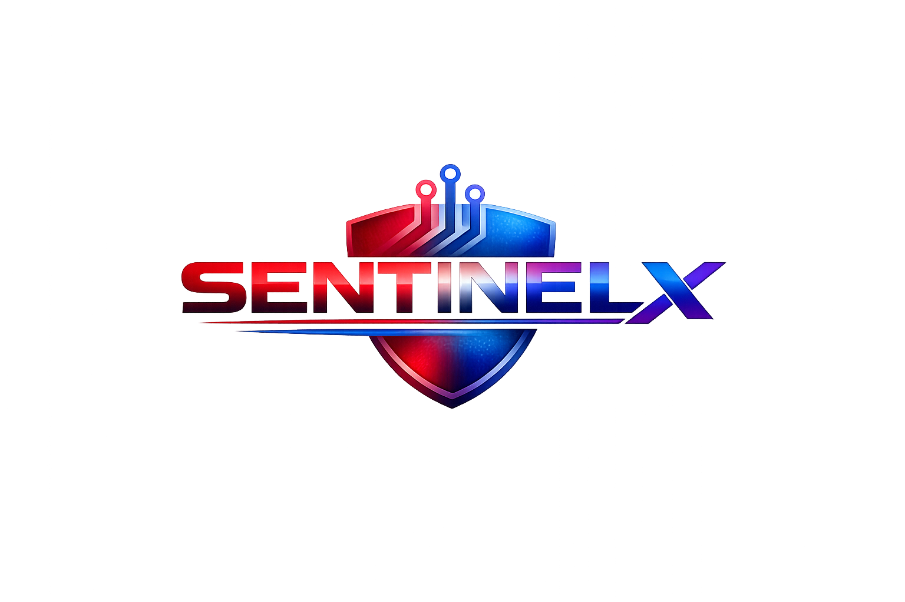

# SentinelX v2.3 - Blue Team Defense & Security Monitoring Framework


[](https://opensource.org/licenses/MIT)


**SentinelX** is a production-ready CLI framework for **continuous security monitoring, threat detection, and defense validation**. Built for security teams and small businesses who need affordable, automated defense.

🔵 **Primary Focus: Blue Team (Defense)** — Plus Red/Purple capabilities for authorized testing.



```text
   _____            _   _            _ __   __
  / ____|          | | (_)          | |\ \ / /
 | (___   ___ _ __ | |_ _ _ __   ___| | \ V / 
  \___ \ / _ \ "_ \| __| | "_ \ / _ \ |  > <  
  ____) |  __/ | | | |_| | | | |  __/ | / . \ 
 |_____/ \___|_| |_|\__|_|_| |_|\___|_|/_/ \_\\

      [ Defense First. Monitoring Always. ]
👥 Who This Is For
User Type	What SentinelX Does For You
Small Business Owners	Affordable, automated security monitoring for your shop or office
Blue Team Defenders	Continuous log analysis, IOC detection, and threat hunting
Purple Teams	Validate that your defenses actually detect real attacks
Red Teams	Authorized security testing (see ethical disclaimer)
🚀 Key Features for Blue Team
Continuous Log Monitoring: Automated parsing of auth.log, web server access.log, and system logs

IOC Scanning: Real-time Indicator of Compromise detection across your infrastructure

YARA + Sigma Rules: Malware pattern matching and threat detection rules

Live Defense Dashboard: Full-screen health monitor showing system status (Option 5)

Automated PDF Reports: Professional security reports for stakeholders

Purple Team Validation: Test if your defenses actually detect real attacks

Ethical Authorization: Built-in consent system ensures legal compliance

📦 Installation & Setup
1. Install via Pip (PyPI)
bash
pip install sentinelx
Note: For full PDF support on Linux, use pip install sentinelx[pdf].

2. Run the Tool
bash
sentinelX
3. Local Development
bash
git clone https://github.com/hackura/SentinelX.git
cd SentinelX
pip install .
🛠️ Module Ecosystem (Ordered by Defense Priority)
🔵 Blue Team (Defensive Operations) — Primary Focus
Continuous Monitoring: Real-time log parsing for auth.log, web server access.log

IOC Scanning: Automated Indicator of Compromise detection across systems

YARA + Sigma: Malware pattern matching and threat detection rules

Live Dashboard: Full-screen health monitoring (Option 5)

🟣 Purple Team (Defense Validation)
Attack → Detection Correlation: Verify your Blue Team controls actually work

Automated Verification: Confirms if simulated attacks are detected by your logs

Cumulative Reports: Merge multiple validation runs into one PDF

🔴 Red Team (Authorized Testing Only)
Recon: Nmap, Amass for authorized asset discovery

Web: Nikto, Nuclei, SQLMap (permission required)

Auth: Hydra for brute-force testing (authorized targets only)

Use these only to test your own defenses, not for random hacking

📊 Advanced Tools
Live Defense Dashboard
Access the dynamic dashboard by selecting Option [5] from the main menu.

PDF Report Generation
Generate a professional security report:

bash
python3 -m sentinelx.core.advanced_reporting
📄 Sample Report
Sample PDF Report

🗑️ Uninstallation
bash
./sentinelx_uninstall.py
🤝 Contributing
Fork the repo

Create a feature branch

Ensure ethical usage

Submit a Pull Request

##❤️ Support the Project
https://img.shields.io/badge/Buy%2520Me%2520a%2520Coffee-ffdd00?style=for-the-badge&logo=buy-me-a-coffee&logoColor=black

##⚠️ Ethical Disclaimer
SentinelX is for authorized security monitoring and defensive validation only. Explicit permission is required to test any target system. Consent is recorded locally at ~/.sentinelx/.consent.
